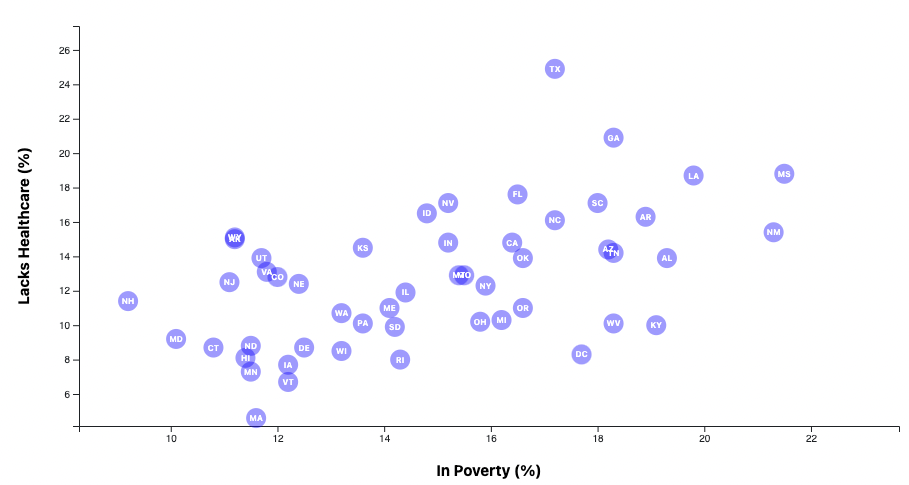

# D3-challenge

## Description
We have been tasked with creating a graph to help readers analyze a data set of 2014 ACS 1-year estimates from the US Census Bureau, which includes data on rates of income, obesity, poverty, healthcare, and more.

The graph generated in this specific repository will study healthcare versus poverty from the data set.

## How to Run Code
Clone this repository and open the HTML file or access the page directly [here](https://shchee5.github.io/D3-challenge). If the page does not load anything, try clearing your cookies and cache from your browser.

Once on the web page, a graph of healthcare vs. poverty should generate with data points labeled with the state abbreviations.

## Results
Here is a preview of what the generated graph looks like:
